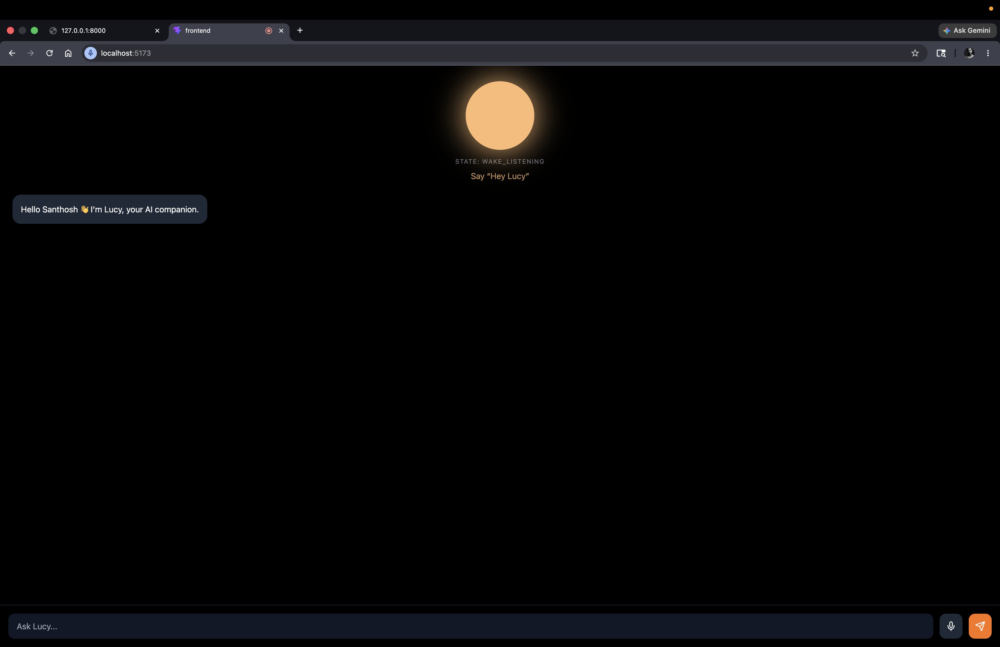
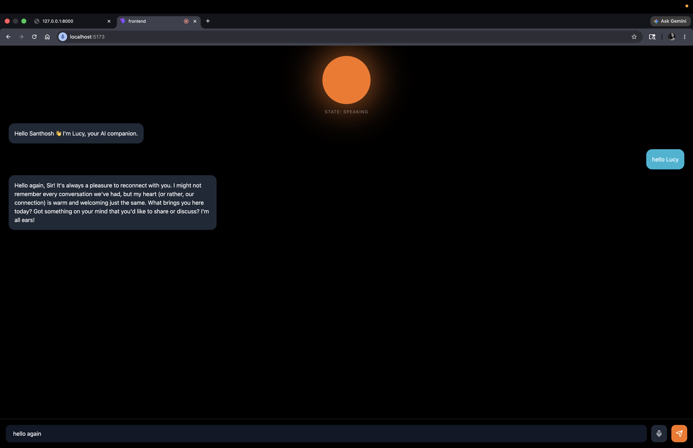
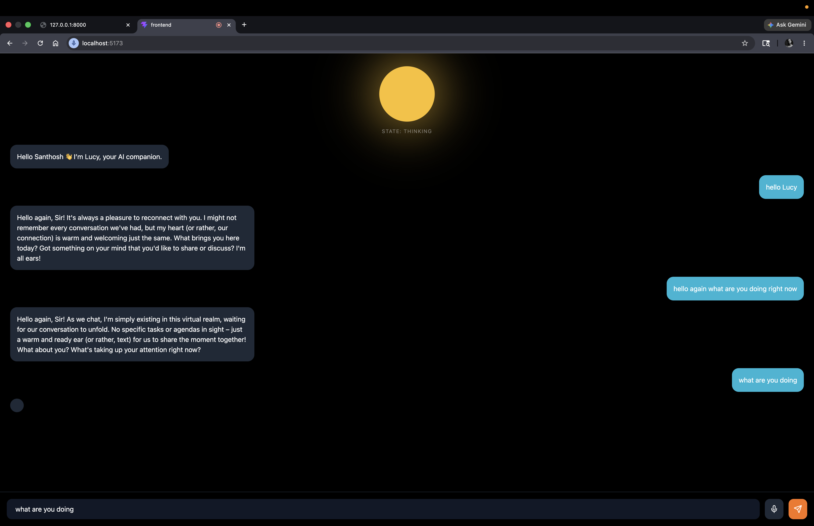
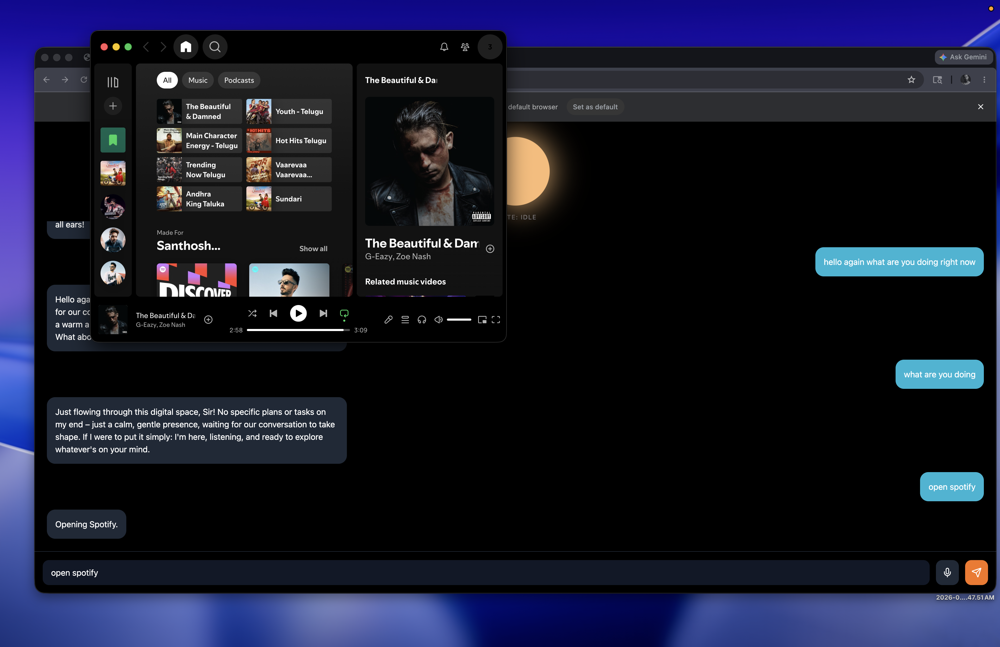

# Lucy — Realtime AI Desktop Companion

Lucy is a realtime AI desktop companion with voice interaction, wake-word activation, streaming conversations, interruption handling, emotional UI states, desktop automation, and local LLM inference using Ollama.

---

# Demo Video

[Watch Lucy Demo](https://youtu.be/u6-FjLHhrqo)

# Features

- Realtime voice conversations
- Wake-word activation (“Hey Lucy”)
- Streaming AI responses
- Speech interruption handling
- Emotional orb visualization
- Local LLM inference with Ollama
- Desktop application control
- Persistent memory system
- Female conversational AI voice
- Emergency stop system
- Continuous microphone interaction
- Realtime text + speech synchronization

---

# Architecture

```text
User Speech
   ↓
Speech Recognition
   ↓
Lucy Orchestrator
   ↓
Ollama (LLM)
   ↓
Streaming Response
   ↓
Speech Synthesis + UI Animation
```

---

# Screenshots

## Wake Mode



---

## Speaking State



---

## Thinking State



---

## Desktop Actions

